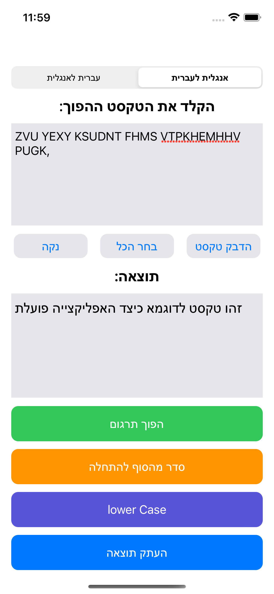
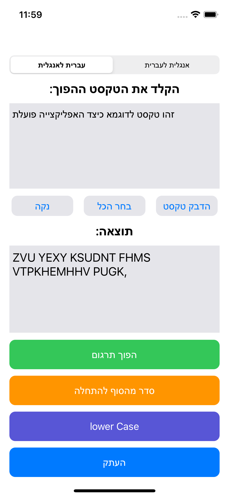
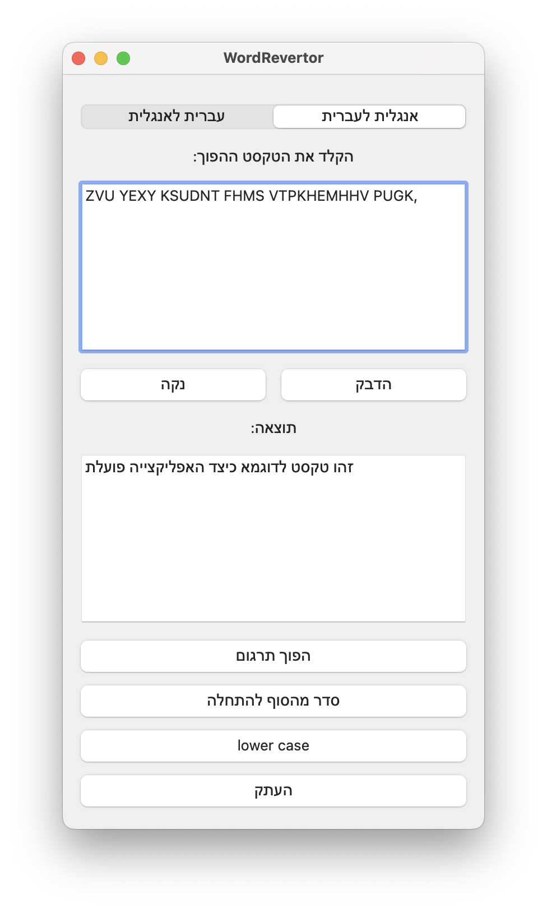
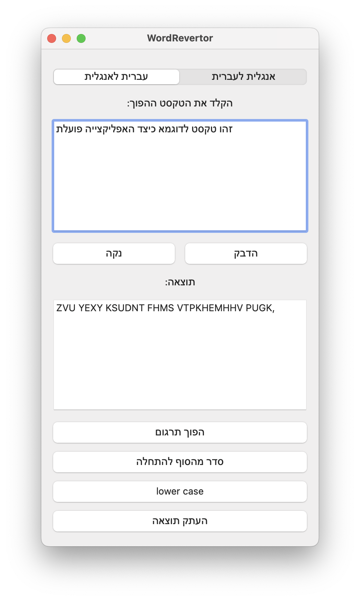

WordRevertor
==========
An application for convert Hebrew and English text (Not translate) - the user has the option to convert text from a Hebrew keyboard to English keyboard and reverse.

The app specially developed application for iPhone and Mac

## Screenshots iPhone
  

    &nbsp;&nbsp;
  &nbsp;&nbsp;

## Screenshots Mac
  

    &nbsp;&nbsp;
  &nbsp;&nbsp;

## Download From App Store
 

&nbsp;&nbsp;

